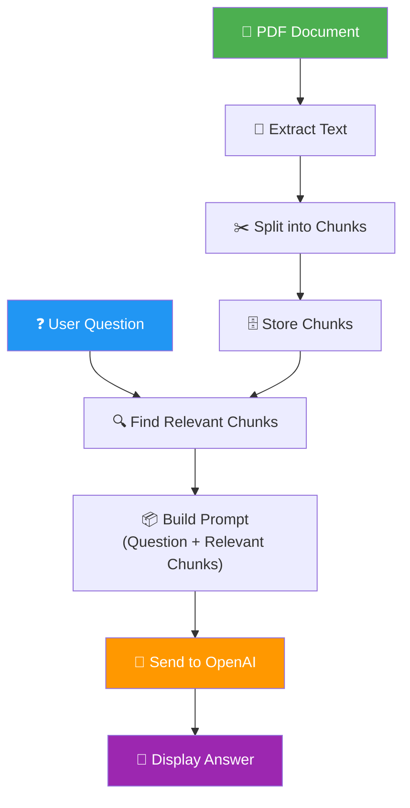

# SarkariSaathi — Project Understanding Document

> **Status:** Understanding phase — no code written yet.  
> **My role:** Teach every concept, explain every line, build step-by-step with your approval.

---

## 1. The Problem (In Plain English)

India has hundreds of government welfare schemes — PM Kisan (cash for farmers), PMAY (housing), Ayushman Bharat (health insurance), etc. The official details live inside dense PDF documents full of legal language, tables, and eligibility criteria.

**The real-world pain:**
- A farmer in Maharashtra wants to know: *"Am I eligible for PM Kisan?"*
- To find out, they'd need to download a 30-page PDF, read through it, and interpret bureaucratic language.
- Most people give up, or rely on middlemen who may give wrong information.

**Your solution:** Build a chatbot where anyone types a question in plain English and gets an accurate answer *pulled directly from the official document* — not from the internet, not hallucinated, but from the actual PDF.

---

## 2. What is RAG? (The Core Concept)

RAG stands for **Retrieval Augmented Generation**. Let me break that down:

| Word | Meaning |
|------|---------|
| **Retrieval** | Finding the relevant pieces of information from a document |
| **Augmented** | Using that information to *enhance* what the AI knows |
| **Generation** | The AI generates a human-readable answer |

### Why not just give the whole PDF to the AI?

Three reasons:
1. **Token limits** — GPT-4o-mini can handle ~128K tokens, but a large PDF could exceed that
2. **Cost** — You pay per token. Sending the entire PDF with every question = expensive
3. **Accuracy** — The more irrelevant text you send, the more likely the AI is to get confused or hallucinate

### The RAG Flow (Step by Step)



**In simple terms:** Instead of giving the AI the whole book, you find the right page first, then ask the AI to read just that page and answer your question.

---

## 3. Tech Stack — What Each Tool Does and Why We Chose It

### Backend

| Tool | What It Does | Why We Use It |
|------|-------------|---------------|
| **Python 3.11** | The programming language | You already know Python; it's the #1 language for AI/ML |
| **FastAPI** | Builds web APIs (endpoints that receive and send data) | Fast, modern, auto-generates docs — great for learning |
| **PyPDF2** | Reads PDF files and extracts text | Simple, no external dependencies, works offline |
| **OpenAI SDK** | Talks to OpenAI's GPT models | Official library, handles auth, retries, errors for you |
| **python-dotenv** | Reads secrets from a `.env` file | Keeps your API key out of your code (security!) |

### Frontend

| Tool | What It Does | Why We Use It |
|------|-------------|---------------|
| **Streamlit** | Turns Python scripts into web apps | No HTML/CSS/JS needed — perfect for AI prototypes |

### AI/LLM

| Tool | What It Does | Why We Use It |
|------|-------------|---------------|
| **GPT-4o-mini** | The AI brain that generates answers | Cheap (~$0.15/1M input tokens), fast, accurate enough for doc Q&A |

### DevOps

| Tool | What It Does | Why We Use It |
|------|-------------|---------------|
| **Git** | Tracks code changes | Industry standard, required for any developer job |
| **GitHub** | Hosts your code online | Portfolio visibility, recruiters look at this |
| **Streamlit Cloud** | Free cloud hosting for Streamlit apps | One-click deploy from GitHub, built-in secrets manager |

---

## 4. Folder Structure — What Each File Does

```
sarkari-saathi/
├── src/                      # All backend logic lives here
│   ├── pdf_loader.py         # Step 1 of RAG: reads the PDF → raw text
│   ├── chunker.py            # Step 2 of RAG: splits text → small pieces
│   ├── retriever.py          # Step 3 of RAG: finds relevant pieces for a question
│   └── qa_engine.py          # Step 4 of RAG: sends pieces + question → OpenAI → answer
├── app.py                    # The Streamlit UI (what the user sees)
├── data/
│   └── pm_kisan.pdf          # The actual government document
├── .env                      # Your OpenAI API key (NEVER shared publicly)
├── .gitignore                # Tells Git which files to skip (like .env)
├── requirements.txt          # Lists all Python packages needed
└── README.md                 # Project documentation for GitHub
```

> [!IMPORTANT]
> The `src/` folder follows a clear separation of concerns — each file does ONE job. This makes the code easy to understand, test, and explain in interviews.

---

## 5. The 9-Step Build Plan — My Understanding

Here's how I understand the build order, and what I'll explain at each step:

### Step 1 — Environment Setup
- Create the folder structure above
- Set up Python virtual environment (`venv`) — I'll explain what isolation means and why
- Create `requirements.txt` with exact versions
- Create `.env` with `OPENAI_API_KEY=your-key-here`
- Create `.gitignore` to protect secrets
- **Teach:** What a virtual environment is, what `.env` files are, why `.gitignore` matters

### Step 2 — PDF Loading (`pdf_loader.py`)
- Write a function that reads `pm_kisan.pdf` and extracts all text
- Print first 500 chars to verify
- **Teach:** How PyPDF2 reads PDFs page by page, what encoding is, common PDF quirks

### Step 3 — Chunking (`chunker.py`)
- Split extracted text into ~500-word chunks with ~50-word overlap
- **Teach:** Why we chunk (token limits + relevance), what overlap means (preventing answers from being split across chunks), print chunk count

### Step 4 — Retrieval (`retriever.py`)
- Take a question, search all chunks, return top 3 relevant ones
- Use simple keyword/TF-IDF matching (no vector DB yet)
- **Teach:** The "R" in RAG — what retrieval is, why we don't send everything, how keyword matching works, what we'd upgrade to later (embeddings, vector DBs)

### Step 5 — QA Engine (`qa_engine.py`)
- Combine retrieved chunks + user question into a prompt
- Call OpenAI API, return the answer
- **Teach:** System prompts, temperature, token counting, cost calculation, why we tell the model "say I don't know if the answer isn't in the context"

### Step 6 — Streamlit Frontend (`app.py`)
- Text input for questions, display area for answers, show source chunks
- **Teach:** What Streamlit is, how `st.text_input()` and `st.write()` work, why it's ideal for AI prototyping

### Step 7 — Testing with 5 Questions
- Run all 5 test questions, verify accuracy
- **CRITICAL RULE:** If any of the 5 questions give a wrong answer, we do not move forward. We stop and debug together first.
- Debug any hallucinations or wrong answers together
- **Teach:** What hallucination is, how to debug RAG (usually a retrieval problem, not an LLM problem)

### Step 8 — Git & GitHub
- Init repo, commit, push
- Write README with problem statement, architecture, run instructions
- **Teach:** `git init`, `git add`, `git commit`, `git push`, what each does

### Step 9 — Deploy to Streamlit Cloud
- Push to GitHub, connect Streamlit Cloud, deploy
- **Teach:** What deployment means, Streamlit Cloud secrets manager vs `.env`, environment variables in the cloud, why `.env` isn't used in production

---

## 6. Key Concepts I'll Teach Along the Way

| Concept | When You'll Learn It | Why It Matters |
|---------|---------------------|----------------|
| Virtual environments | Step 1 | Prevents package conflicts between projects |
| API keys & secrets | Step 1 | Security — leaked keys = someone else's bill |
| PDF text extraction | Step 2 | Foundation of any document AI system |
| Chunking & overlap | Step 3 | Core RAG concept, interview topic |
| Retrieval (keyword → embeddings) | Step 4 | The "R" in RAG, most important part |
| Prompt engineering | Step 5 | How you talk to an LLM matters enormously |
| System prompts | Step 5 | Controls the AI's persona and behavior |
| Temperature | Step 5 | Controls randomness — 0 = deterministic, 1 = creative |
| Token counting & cost | Step 5 | Real-world engineering concern |
| Hallucination | Step 7 | When the AI makes up information — must be prevented |
| Git workflow | Step 8 | Version control — non-negotiable for any dev |
| Cloud deployment | Step 9 | Getting your app live for the world to see |

---

## 7. Cost Estimates (Rough)

| Component | Cost |
|-----------|------|
| GPT-4o-mini input tokens | ~$0.15 per 1M tokens |
| GPT-4o-mini output tokens | ~$0.60 per 1M tokens |
| **Per question (estimated)** | **~$0.001–$0.003** (less than half a paisa) |
| 1,000 questions/day | ~$1–3/day |
| Streamlit Cloud hosting | Free tier |
| GitHub | Free |

> [!TIP]
> At this scale, **cost is negligible**. The project is designed to be practically free to run while learning.

---

## 8. What You'll Be Able to Explain After Building This

1. ✅ What RAG is and why it exists
2. ✅ Every file in the project and its purpose
3. ✅ What an API key is and why it must be protected
4. ✅ How to calculate the cost of running an LLM-based app
5. ✅ What you'd change to handle 1,000 users (vector DB, caching, load balancing)

---

## 9. What I Need From You Before We Start Building

1. **Do you have an OpenAI API key?** (If not, I'll walk you through getting one — it takes 2 minutes)
2. **Do you have the `pm_kisan.pdf` file ready?** (If not, I can help you find/download the official document)
3. **Do you have Python 3.11 installed?** (I can help verify this)
4. **Does this understanding match your expectations?** Tell me if I've missed or misunderstood anything.

---

> [!NOTE]
> **My commitment:** I will not write more than 20–30 lines without stopping to explain. After every file, I'll ask if you understood before moving on. If I use any concept you haven't seen (decorators, async, classes), I'll explain it first. No jargon without explanation.
