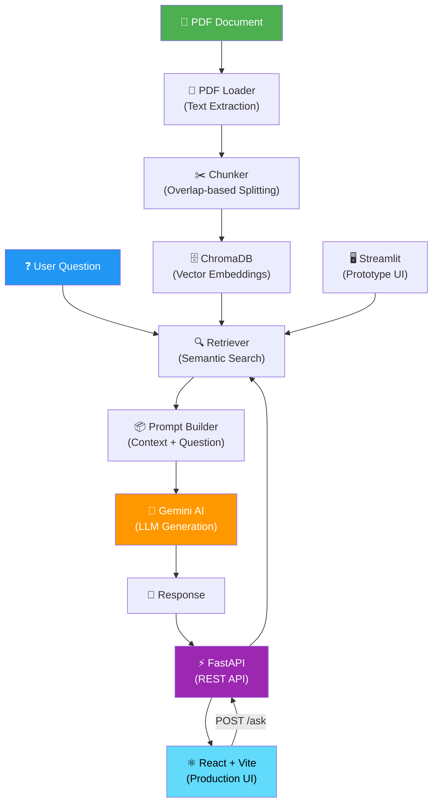

<p align="center">
  
  
  
  
  
  
  
</p>

# SarkariSaathi 🏛️ — AI-Powered Government Scheme Assistant

> A production-grade **Retrieval-Augmented Generation (RAG)** application that enables Indian citizens to query official government welfare scheme documents in plain English and receive accurate, source-cited answers — built with a strong emphasis on **modular architecture, API design, automated testing, and software quality assurance.**

---

## 📌 Problem Statement

India has hundreds of government welfare schemes (PM Kisan, PMAY, Ayushman Bharat, etc.) with details buried inside dense PDF documents full of legal language, tables, and eligibility criteria. Citizens often struggle to find relevant information, leading to reliance on misinformation or costly middlemen.

**SarkariSaathi solves this** by letting anyone type a question in plain English and receive an accurate answer pulled directly from the official PDF — not from the internet, not hallucinated, but from the verified source document.

---

## 🏗️ System Architecture



---

## 🛠️ Tech Stack

### Backend & API Layer

| Technology | Purpose | Why Chosen |
|---|---|---|
| **Python 3.11** | Core language | Industry standard for AI/ML; strong library ecosystem |
| **FastAPI** | REST API framework | Auto-generated Swagger docs, async support, Pydantic validation |
| **Uvicorn** | ASGI server | High-performance server for production-grade API serving |
| **Pydantic** | Data validation | Enforces strict request/response schemas on API endpoints |

### AI & Document Processing Pipeline

| Technology | Purpose | Why Chosen |
|---|---|---|
| **PyPDF2** | PDF text extraction | Lightweight, zero-dependency offline document parsing |
| **ChromaDB** | Vector database | Stores and queries document embeddings for semantic search |
| **Google Gemini (2.5 Flash)** | LLM for answer generation | Cost-effective, fast, accurate; `temperature=0.0` for deterministic output |
| **Google Generative AI Embeddings** | Embedding generation | Converts text chunks into semantic vectors for similarity matching |

### Frontend

| Technology | Purpose | Why Chosen |
|---|---|---|
| **React 18** | Production SPA framework | Component-based architecture, state management, reusable UI |
| **Vite 8** | Build tool & dev server | Lightning-fast HMR, optimized production builds, modern ESM |
| **Lucide React** | Icon library | Consistent, tree-shakeable SVG icons across the entire UI |
| **Vanilla CSS** | Styling system | Custom design tokens, CSS variables, glassmorphic effects, animations |
| **Streamlit** | Rapid prototyping UI | Quick iteration during initial development phase |

### DevOps & Quality

| Technology | Purpose | Why Chosen |
|---|---|---|
| **Git & GitHub** | Version control | Branching, history tracking, collaboration |
| **python-dotenv** | Secrets management | Secure `.env`-based API key handling; never hardcoded |
| **Modular test scripts** | Automated validation | End-to-end pipeline testing & error tracing |

---

## 🧪 Testing & Quality Assurance

This project follows a **structured testing methodology** to ensure correctness at every stage of the RAG pipeline:

### Testing Strategy

| Test Type | File | What It Validates |
|---|---|---|
| **Unit Testing** | Each `src/*.py` has `__main__` test blocks | Individual module correctness (PDF extraction, chunking, retrieval, generation) |
| **Integration Testing** | `test_retrieve.py` | Full pipeline validation — PDF → Chunks → Vector Search → LLM Answer |
| **Error & Exception Testing** | `test_error.py` | Graceful failure handling with `try/except` and full `traceback` logging |
| **API Endpoint Testing** | `api.py` (`POST /ask`) | REST API contract validation via FastAPI auto-generated Swagger UI |

### Quality Practices Demonstrated

- ✅ **Modular, testable architecture** — Each module (`pdf_loader`, `chunker`, `retriever`, `qa_engine`) has a single responsibility and can be tested in isolation
- ✅ **Data-driven test cases** — Test scripts parameterize questions to validate different retrieval scenarios
- ✅ **Error tracing & debugging** — `test_error.py` wraps the full pipeline in structured exception handling with `traceback.print_exc()` for root-cause analysis
- ✅ **API contract validation** — FastAPI + Pydantic enforces strict `QuestionRequest` schema; auto-generated `/docs` endpoint provides interactive Swagger testing
- ✅ **Deterministic AI output** — `temperature=0.0` ensures consistent, reproducible LLM responses across test runs
- ✅ **Environment isolation** — Virtual environment (`venv`) + `.gitignore` ensures clean, reproducible setups

---

## 📁 Project Structure

```text
sarkari-saathi/
├── frontend/                     # React + Vite Production Frontend
│   ├── src/
│   │   ├── components/
│   │   │   ├── Navbar.jsx        # Glassmorphic scroll-aware navbar
│   │   │   ├── Hero.jsx          # Animated hero with gradient blobs
│   │   │   ├── Features.jsx      # 6-card feature grid
│   │   │   ├── HowItWorks.jsx    # RAG pipeline timeline
│   │   │   ├── TechStack.jsx     # Technology pill grid
│   │   │   ├── Footer.jsx        # Dark premium footer
│   │   │   ├── Chatbot.jsx       # Floating AI chatbot widget
│   │   │   └── *.css             # Component-scoped styles
│   │   ├── App.jsx               # Root component with layout
│   │   ├── main.jsx              # Entry point
│   │   └── index.css             # Design system (tokens, animations)
│   ├── index.html                # SEO-optimized HTML shell
│   └── package.json              # Node.js dependencies
├── src/                          # Core backend modules (Separation of Concerns)
│   ├── pdf_loader.py             # PDF text extraction with PyPDF2
│   ├── chunker.py                # Overlap-based text chunking algorithm
│   ├── retriever.py              # Semantic search via ChromaDB + Google Embeddings
│   └── qa_engine.py              # LLM integration with prompt engineering
├── static/                       # Legacy static frontend
├── api.py                        # FastAPI REST API with CORS & Swagger docs
├── app.py                        # Streamlit prototype frontend
├── test_error.py                 # Error handling & exception tracing tests
├── test_retrieve.py              # End-to-end retrieval pipeline test
├── data/
│   └── pm_kisan.pdf              # Official government source document
├── requirements.txt              # Pinned Python dependencies
├── .env                          # API key (excluded from version control)
└── .gitignore                    # Security & hygiene rules
```

---

## 🚀 Getting Started

### Prerequisites

- Python 3.11+
- Node.js 18+ & npm
- Google Gemini API Key ([Get one free](https://aistudio.google.com/apikey))

### Installation

```bash
# 1. Clone the repository
git clone https://github.com/<your-username>/Sarkari-Sathi.git
cd Sarkari-Sathi

# 2. Create and activate a Python virtual environment
python -m venv venv
source venv/bin/activate        # macOS/Linux
# venv\Scripts\activate         # Windows (Command Prompt)

# 3. Install Python dependencies
pip install -r requirements.txt

# 4. Install React frontend dependencies
cd frontend && npm install && cd ..

# 5. Configure environment variables
echo "GOOGLE_API_KEY=your_api_key_here" > .env
```

### Running the Application

```bash
# Terminal 1 — Start the FastAPI backend
uvicorn api:app --reload
# API docs available at http://127.0.0.1:8000/docs (Swagger UI)

# Terminal 2 — Start the React frontend
cd frontend && npm run dev
# Open http://localhost:5173 in your browser

# Alternative — Streamlit prototype (no React needed)
streamlit run app.py
```

### Running Tests

```bash
# End-to-end pipeline test
python test_retrieve.py

# Error handling & exception test
python test_error.py

# Individual module tests
python src/pdf_loader.py
python src/chunker.py
python src/retriever.py
python src/qa_engine.py
```

---

## 🔑 Key Engineering Decisions

| Decision | Rationale |
|---|---|
| **Chunk overlap (20 words)** | Prevents critical information from being split across chunk boundaries — a common RAG failure mode |
| **ChromaDB over keyword search** | Semantic (meaning-based) retrieval is far more accurate than simple TF-IDF for natural language queries |
| **Temperature = 0.0** | Eliminates randomness in LLM output, ensuring deterministic, testable, reproducible answers |
| **System prompt with strict grounding** | Instructs the model to say "I don't know" rather than hallucinate — critical for government information accuracy |
| **FastAPI + Pydantic validation** | Enforces type-safe API contracts; auto-generates interactive documentation for manual and automated testing |
| **Separation of concerns (4 modules)** | Each file handles one stage of the pipeline, enabling isolated unit testing and independent debugging |

---

## 📊 Skills Demonstrated

| Category | Skills |
|---|---|
| **Programming** | Python (OOP, modular design, exception handling, data types, loops) |
| **API Development** | RESTful API design, endpoint testing, request/response validation, Swagger/OpenAPI |
| **Testing & QA** | Test strategy design, unit/integration/E2E testing, error tracing, deterministic validation |
| **Databases** | Vector database operations (ChromaDB), embedding storage, semantic querying |
| **Web Technologies** | React, Vite, component architecture, HTML5, CSS3, JavaScript, responsive design |
| **AI/ML** | RAG architecture, prompt engineering, LLM integration, embedding models |
| **DevOps** | Git version control, environment management, secrets handling, dependency pinning |
| **Problem Solving** | Analytical debugging, pipeline-stage isolation, edge case handling |
| **SDLC** | Iterative development (prototype → production), modular architecture, documentation |

---

## 📜 License

This project is open source and available for educational and portfolio purposes.

---

<p align="center">
  <b>Built with ❤️ to make government information accessible to every Indian citizen.</b>
</p>
